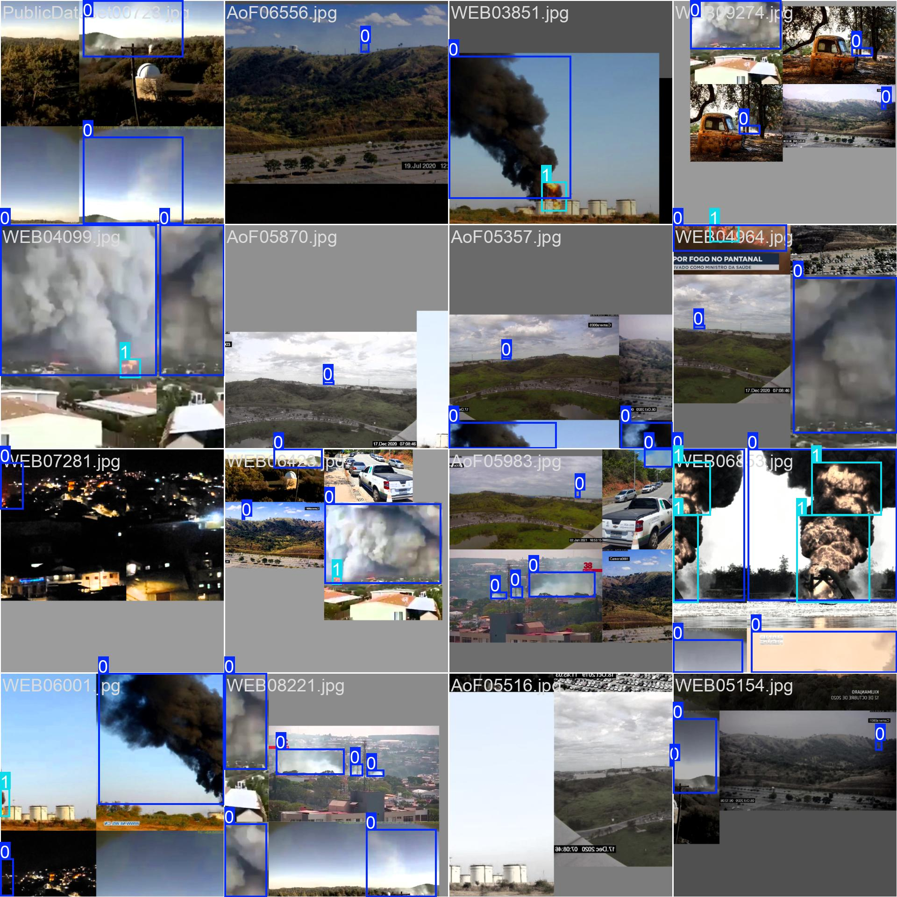
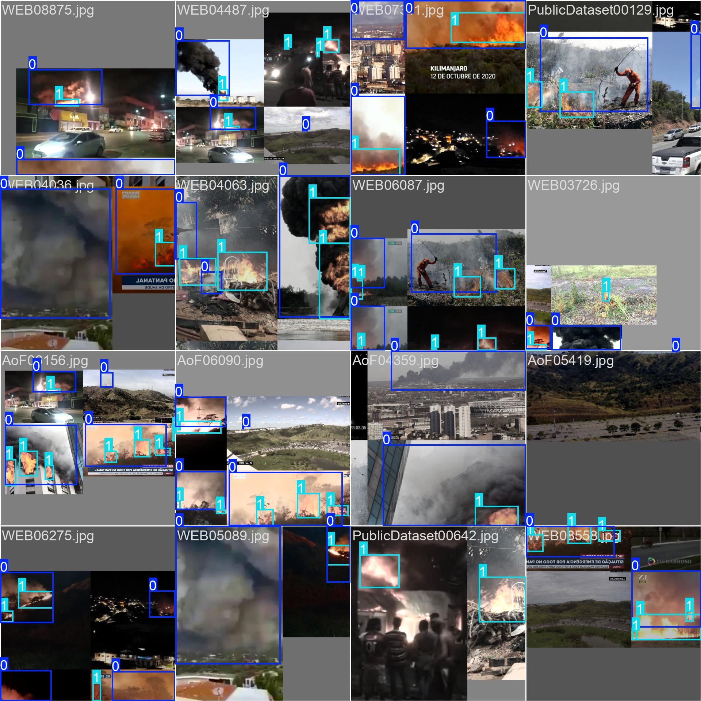
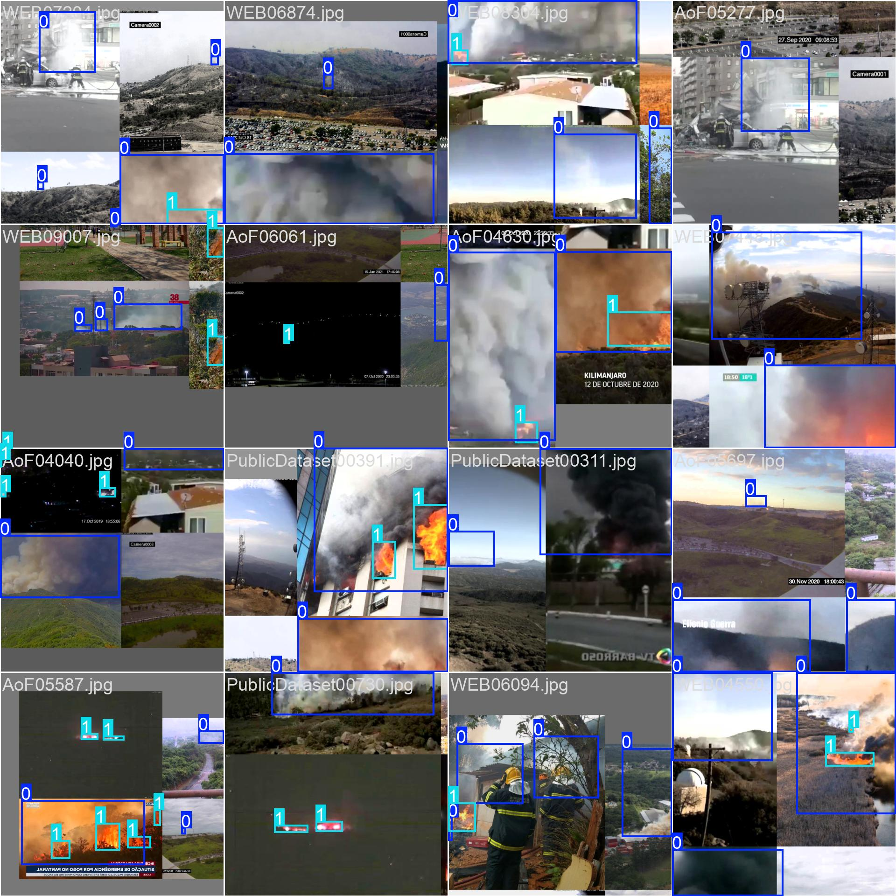
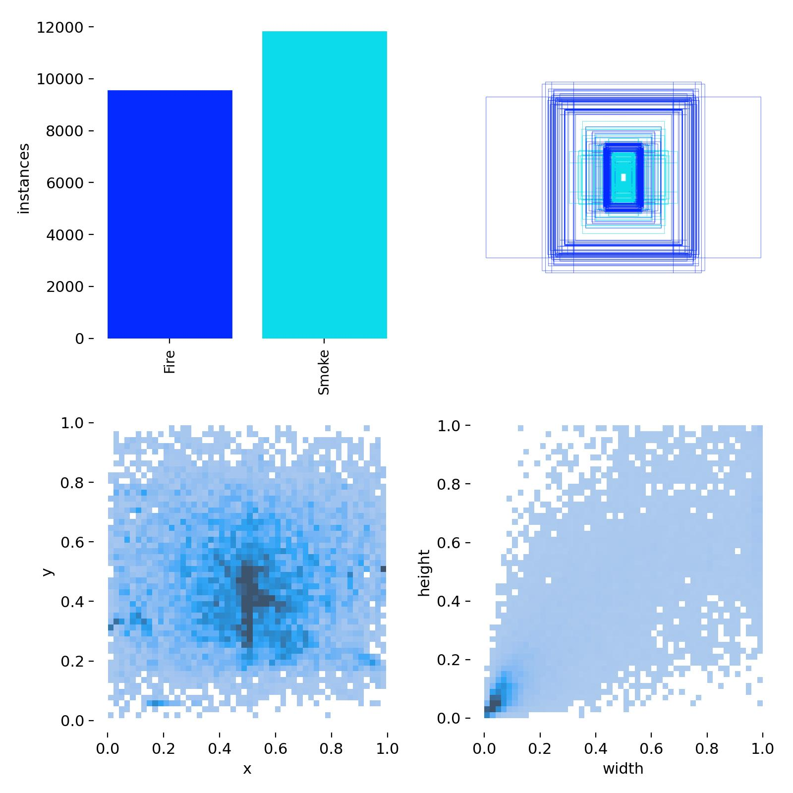
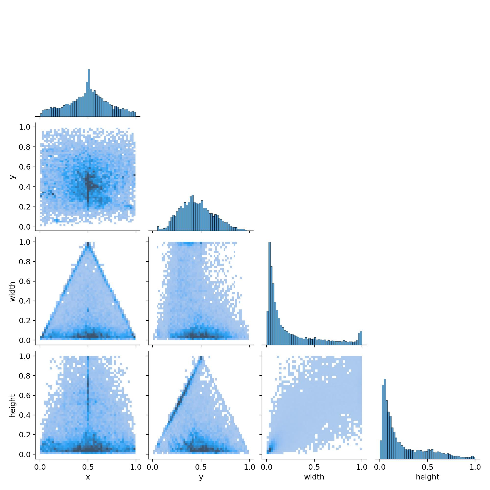

# Wildfire Detection using YOLOv8

This project applies the YOLOv8 object detection model to identify wildfire-related elements—specifically fire and smoke—from real-time image and video streams. It is designed to support early wildfire response efforts with accurate and fast detection.

---

## Project Overview

- **Model**: YOLOv8 (small variant: `yolov8s`)
- **Framework**: Ultralytics YOLO, PyTorch
- **Detection Classes**: `fire`, `smoke`
- **Dataset Size**: Standardized image input size: 640×640
- **Model Accuracy**: **78%**

---

## File Structure

```
wildfire-detection-yolov8/
├── data/
│   ├── images/            # Training and validation images
│   └── labels/            # YOLO-format annotations
├── runs/                  # Training outputs (e.g., results, weights)
├── yolov8s.pt             # Pretrained YOLOv8 model
├── wildfire.yaml          # Dataset configuration
├── train.py               # Training script
├── detect.py              # Inference script
└── README.md              # Project documentation
```

---

## Dataset Sample Visuals

Training batch samples:





Label overview:



---

## Exploratory Data Analysis

### Label Feature Distribution

The scatter matrix below shows relationships between bounding box attributes (x, y, width, height) colored by class.



Insights:
- **Fire vs. Smoke** have partially distinct distributions.
- Bounding boxes for fire tend to be smaller in both width and height.
- There’s a noticeable skew in feature distributions, especially height and width.

---

## Model Performance Summary

- **Precision**: 78.3%
- **Recall**: 70.4%
- **mAP@0.50**: 77.6%
- **mAP@0.50–0.95**: 45.0%

### Per-Class Metrics
| Class  | mAP@0.50 |
|--------|----------|
| Fire   | 0.5237   |
| Smoke  | 0.3772   |

---

## Training & Inference Speed

| Stage        | Time per Image |
|--------------|----------------|
| Preprocess   | 0.213 sec      |
| Inference    | 1.783 sec      |
| Postprocess  | 1.844 sec      |

---

## Hyperparameter Tuning

Experiments involved adjustments to:
- `lr0`, `lrf`: Initial and final learning rate
- `batch`: Batch size
- `imgsz`: Image resolution
- Data augmentations such as: `mosaic`, `hsv_h`, `flipud`

---

## Future Enhancements

- Integration with **thermal/infrared sensors**
- Deploy on **Edge AI** devices (Jetson, Raspberry Pi)
- Expand dataset with **drone and surveillance video**
- Improve class imbalance with **custom augmentations**

---

## Author

**Aditya Sinha**  
M.S. in Data Science @ Drexel University  
Research Assistant, Urban Health Collaborative  
Email: as5869@drexel.edu
